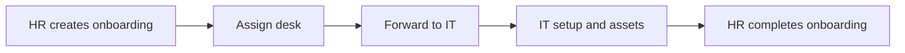

Workplace operations platform for HR, IT, and facilities teams. It connects employee records, onboarding and offboarding workflows, IT asset assignments, and desk allocation in one Laravel application with role-based access, in-app notifications, and a REST API.

## Modules

### HR Management

- Maintain employee profiles, departments, and reporting lines.
- Run onboarding from hire through desk assignment, IT handoff, and completion.
- Run offboarding with desk release and IT asset recovery.
- Track onboarding asset provision status on list and detail views.

### IT Asset Management

- Register assets by type and manage inventory status.
- Assign and return assets during onboarding and offboarding.
- Complete IT setup steps after HR forwards a request to IT.

### Desk Allocation System

- Manage buildings, floors, and desks.
- Assign desks during onboarding and release them during offboarding.
- Keep desk availability in sync with active allocations.

### Reports

- View operational snapshots for employees, onboarding, offboarding, desks, and assets.
- Review status breakdowns grouped by module.

### Administration

- Configure buildings, floors, and departments.
- Review audit logs for sensitive changes.

## Roles

| Role | Typical responsibilities |
| --- | --- |
| Admin | Full configuration access, desk maintenance, audit log, and cross-module visibility |
| HR | Employees, onboarding, offboarding, desk assignment, and onboarding completion |
| IT | Onboarding queue, IT setup, asset inventory, assignment, and offboarding recovery |

Users without one of these roles can sign in but only see the base dashboard until an administrator assigns access.

## Tech stack

- PHP 8.1+ and Laravel 10
- MySQL
- Laravel Breeze authentication
- Spatie Laravel Permission for roles
- Laravel Sanctum for API tokens
- Tailwind CSS, Alpine.js, and Vite for the UI
- Optional Pusher or Laravel Reverb for live notification delivery

## Prerequisites

- PHP 8.1 or newer with common Laravel extensions
- Composer
- Node.js 18+ and npm
- MySQL 8 or compatible server

## Local setup

1. Clone the repository and install dependencies.

```bash
composer install
npm install
```

2. Create the environment file and application key.

```bash
cp .env.example .env
php artisan key:generate
```

3. Configure database credentials in `.env`.

```env
DB_CONNECTION=mysql
DB_HOST=127.0.0.1
DB_PORT=3306
DB_DATABASE=Test
DB_USERNAME=root
DB_PASSWORD=
```

4. For local development, keep outbound mail in the log driver so messages are written to `storage/logs/laravel.log` instead of an SMTP service.

```env
MAIL_MAILER=log
MAIL_HOST=127.0.0.1
```

5. Run migrations and seed demo data.

```bash
php artisan migrate --seed
```

6. Build frontend assets and start the application.

```bash
npm run build
php artisan serve
```

For asset hot reload during UI work, run `npm run dev` in a second terminal.

## Seeded demo access

After `php artisan migrate --seed`, these accounts are available. Change passwords before any shared or production environment.

| Role | Email | Password |
| --- | --- | --- |
| Admin | `admin@zylitix.local` | `password` |
| HR | `hr@zylitix.local` | `password` |
zylitix
Seeders also create departments, asset types, a Headquarters building with Ground and Level 1 floors, sample desks, and sample employees with a reporting-manager hierarchy.

## Common workflows

### Onboarding



HR owns employee setup, desk assignment, forwarding, and final completion. IT owns setup start and completion plus asset assignment. HR actions for desk setup and cancellation are limited once a request has moved into the IT queue.

### Offboarding

HR opens an offboarding request. IT can start asset recovery and mark assets returned. HR or IT can release the desk depending on the request state. HR completes the request when recovery and desk release are finished.

## Navigation

The authenticated UI uses a sidebar grouped by module:

- Dashboard and Reports
- HR Management Module
- IT Asset Management Module
- Desk Allocation System
- Administration for admin users

The top bar keeps account actions, notifications, and the mobile menu toggle.

## Notifications

In-app notifications poll the authenticated notifications endpoint and can surface browser alerts after the user enables them. Live websocket delivery is optional and depends on Pusher or Reverb configuration in `.env`.

## API

Authenticated JSON endpoints live under `/api/v1`. Login returns a Sanctum token for subsequent requests.

Representative routes:

- `POST /api/v1/login`
- `GET /api/v1/employees`
- `GET /api/v1/onboarding-requests`
- `POST /api/v1/onboarding-requests/{id}/forward-it`
- `GET /api/v1/assets`
- `POST /api/v1/assets/{id}/assign`

Role checks on the API mirror the web application. See `routes/api.php` for the full surface area.

## Development commands

```bash
php artisan migrate:fresh --seed   # Reset database and reseed
php artisan config:clear           # Clear cached config after .env changes
php artisan route:list             # Inspect registered routes
npm run dev                        # Vite dev server
npm run build                      # Production frontend build
php artisan test                   # Run automated tests
```

## Project layout

```text
app/Http/Controllers/     Web and API controllers
app/Models/               Domain models and workflow helpers
app/Services/             Desk assignment and related services
database/migrations/      Schema
database/seeders/         Roles, org structure, and sample data
resources/views/          Blade UI, including module screens and reports
routes/web.php            Authenticated web routes
routes/api.php            Sanctum API routes
```

## Testing

Feature and unit tests use PHPUnit. Configure the testing database in `phpunit.xml` or through environment variables before running `php artisan test`.

## License

This project is open-source software licensed under the [MIT License](https://opensource.org/licenses/MIT).
